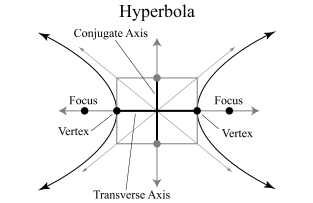

# Math Docs
___

- [Math Docs](#math-docs)
  - [Hyperbola](#hyperbola)
    - [Equation of a Hyperbola](#equation-of-a-hyperbola)
    - [Properties of Hyperbolas](#properties-of-hyperbolas)
  - [Line](#line)
  - [Point(x, y)](#pointx-y)
    - [Each of the following are both a classmethod and instancemethod](#each-of-the-following-are-both-a-classmethod-and-instancemethod)
  - [Parabola!](#parabola)
  - [Circle:](#circle)
  - [Ellipse](#ellipse)
    - [Class](#class)
    - [Special Points](#special-points)
    - [Equation](#equation)
    - [How to tell it's type](#how-to-tell-its-type)
  - [TemplateClass](#templateclass)
  - [Conic Sections](#conic-sections)
    - [Equation of a Conic Section](#equation-of-a-conic-section)
    - [Discriminants](#discriminants)
    - [Class Info](#class-info)


___


## Hyperbola

A hyperbola is the set of all points in a plane equidistant from the foci. Each branch of the hyperbola contains a vertex point, and the curve wraps around a focus point within boundaries known as asymptotes. Both the vertex points and the foci lie on an axis of symmetry which contains a segment between the vertex points known as the transverse axis. There is another axis of symmetry perpendicular to the transverse axis that contains a segment referred to as the conjugate axis. The center of the hyperbola is the intersection point of these two axes.




### Equation of a Hyperbola

With a horizontal transverse axis:
```
(x - h)^2   (y - k)^2
————————— - ————————— = 1
   a^2         b^2
```

With a vertical transverse axis:
```
(y - k)^2   (x - h)^2
————————— - ————————— = 1
   a^2         b^2
```
c^2 = a^2 + b^2

### Properties of Hyperbolas

|   | Horizontal | Vertical |
| - | ---------- | -------- |
| Equation | `( (x - h)^2 / a^2 ) - ( (y - k)^2 / b^2 ) = 1` | `( (y - k)^2 / a^2 ) - ( (x - h)^2 / b^2 ) = 1 ` |
| Center | `(h, k)` | `(h, k)` |
| Foci | `(h - c, k)` and `(h + c, k)` | `(h, k - c)` and `(h, k + c)` |
| Vertices | `(h - a, k)` and `(h + a, k)` | `(h, k - a)` and `(h, k + a)` |
| Slopes of Asymptotes | `b / a` and `-b / a` | `a / b` and `-a / b`


---


## Line


`::__init__(p1, p2)`
* `p1`: The start point, in the form of a Point, a tuple, or a list
* `p2`: The end point, in the same form as `p1`


`.length`
* Calculates the length of the line


---


## Point(x, y)

### Each of the following are both a classmethod and instancemethod
distance = √( (x1 - x2)^2 + (y1-y2)^2 )
midpoint = ( (x1+x2)/2 , (y1+y2)/2 )


---


## Parabola!


---


## Circle:

(x-h)^2 + (y-k)^2 = r^2

Where center = Point(h, k)


---


## Ellipse

The set of all points in a plane where the sum of the distances from two special points, called focus points or foci, is equal.

Every ellipse has two axes of symmetry. The parts of the axes of symmetry which lie inside the ellipse are called the major and minor axes. The two foci will always lie on the major axis.

### Class

`::__init__`
- `major_axis_1`: the start of the major axis, in the form of a Point
- `major_axis_2`: the end of the major axis, in the form of a Point
- `focus_point_1`: one of the focus points, a Point
- `focus_point_2`: the other focus point, a Point
- `center`: the center of the ellipse, a Point

`.h`: The x of the center point

`.k`: The y of the center point

`.a`: Half the major axis's length

`.c`: Half the distance between the focus points

`.b`: The square root of `a^2 -  c^2`, and the distance bewteen the center and the foci

`.type`: Returns "horizontal" or "vertical"

`.equation`: Returns the equation for the ellipse

### Special Points
The focus points, or foci, lie on the major axis.
Consequently, the major axis is a longer segment whose distance is `2a`, whereas the minor axis is the shorter segment whose distance is `2b(a > b)`.
The distance between the foci is `2c`.
There is a special relationship between `a`, `b` and `c` in an ellipse. self relationship, involving the Pythagorean theorem, is `b^2 = a^2 - c^2`

### Equation
The equation of an ellipse with a horizontal major axis and center `(h, k)` is:
```
(x - h)^2    (y - k)^2
—————————— + —————————— = 1
   a^2          b^2
```

The equation of an ellipse with a vertical major axis and center `(h, k)` is:
```
(x - h)^2    (y - k)^2
—————————— + —————————— = 1
   b^2          a^2
where b^2 = a^2 - c^2
```

### How to tell it's type
`a > b`


---


## TemplateClass

`::__init__(name)`
- `name`: the name to use in greetings

`::hi`
- `greeting`: The greeting to use, defaults to "Hello, "
- `punctuation`: A puctuation character, defualts to "!"

`.name`
- The name passed into `__init__`

---


## Conic Sections

All circles, ellipses, hyperbolas, and parabolas are conic sections.
They all share the same equation, so it can be difficult to tell the apart.
We use discriminants to tell the apart from one another.

### Equation of a Conic Section

The equation for a conic section is:
```
Ax^2 + Bxy + Cy^2 + Dx + Ey + F = 0
```
where `A`, `B`, and `C` are not all 0.

### Discriminants

The discriminant of a conic section (using the above formula) can be calculated by using:
```
d = B^2 - 4AC
```
From there, you can tell the type of conic section using this table:
| Conic Section | Discriminant |
| ------------- | ------------ |
| Parabola      | `d = 0`      |
| Hyperbola     | `d > 0`      |
| Circle        | `d < 0, B = 0, A = C` |
| Ellipse       | `d < 0, B != 0` |
| Ellipse       | `d < 0, A != 0, C != 0, A != C` |

### Class Info

`::__init__(A, B, C, D, E, F)` <br/>
Create a new ConicSection. <br/>
A, B, C, D, E, and F are the same as in the equation.

`::discrimiant` <br/>
A property, which calulates the discrimiant. <br/>
It uses `B^2 - 4AC`

`::type` <br/>
Get the type of Conic Section. <br/>
It uses the table listed above, and return the class for that type of conic section.
